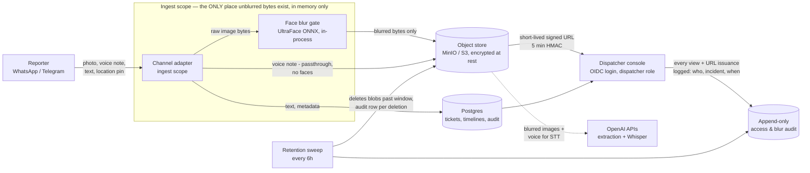

# First10 — Personal-data flow (NDPA review input)

> Prepared for legal review (G4). Maps every path personal data takes through the system,
> where it is transformed, who can see it, and when it is destroyed. Enforcement is
> structural — each control below names the test or mechanism that pins it.

## The one-page picture

## Data categories and their handling

| Data | Personal? | Transform | Storage | Visible to | Deleted |
|---|---|---|---|---|---|
| Crash-scene photo | Yes — faces | **Blurred in-memory before persistence** (D-009); irreversible pixelate+blur | Object store, blurred form ONLY | Dispatcher (signed URL), extraction AI (blurred) | Retention window (default 30d — lawyer to confirm) |
| Voice note | Yes — voice is biometric-adjacent personal data | None (dispatcher must hear the real voice; STT needs real audio) | Object store | Dispatcher (signed URL), Whisper STT | Same retention window |
| Voice transcript | Yes — content may name people | STT output stored as text beside audio | Postgres timeline | Dispatcher | Kept as incident record (content review: lawyer) |
| Message text | Possibly — reporter may name people | Stored verbatim (dispatch accuracy) | Postgres timeline | Dispatcher | Kept as incident record |
| Reporter identity | Yes — phone number / channel id | Stored as (Channel, ExternalUserId); never shown in summaries (reporter-anonymous digests) | Postgres | Dispatcher (timeline only) | With conversation data at pilot close |
| Location pins | Contextual | Stored as lat/lng | Postgres | Dispatcher | Kept as incident record |
| pHash (image fingerprint) | No — 64-bit non-invertible hash | Computed from blurred image | Postgres | Nobody (internal dedup) | Kept (cannot reconstruct any image) |

## Controls and their enforcement

1. **Unblurred bytes never persist and never leave the process** (D-009).
   The only code path to media persistence is `SecureMediaIngest`, which blurs first.
   *Enforced by:* architecture test `No_code_path_outside_SecureMediaIngest_can_persist_media`
   (fails the build if any new call site appears) + fully in-process ONNX detection (no
   cloud vision API ever sees raw bytes).
2. **Conservative blur.** Low-confidence detections are blurred with enlarged regions;
   if the detector cannot run, the whole frame is blurred; undecodable images are
   refused. A maybe-face is never shipped. *Enforced by:* `BlurGateTests`.
3. **Blur accuracy gate.** ≥98% on the labelled 50-image corridor set before soft
   launch. *Enforced by:* `BlurBenchmarkTests` (hard-fails once the set is present).
4. **Every access is attributable.** Console requires OIDC login (dispatcher role);
   ticket views and every signed-URL issuance write `{who, incident, mediaRef, when}`
   audit rows; media is served only against a 5-minute HMAC signature.
5. **Retention is automatic.** A durable scheduled job deletes media past the window
   (default 30 days — **provisional pending the lawyer's number**) and writes a deletion
   audit row. Text/transcripts remain as the incident record. Audit rows are never deleted.
6. **AI never sees identity.** Timeline digests and crew briefings are generated from
   reporter-anonymous snapshots; clinical texts are selected by id from an approved
   library, never generated (D-011/D-014).

## Open items for the lawyer

- Confirm the media retention window (currently 30 days, configurable).
- Voice notes: we retain the raw audio inside the window because the dispatcher's ear is
  a safety control (STT mangles Pidgin/Yorùbá under siren noise). Confirm this basis.
- Text/transcript/location retention beyond media window (currently: retained as the
  incident record for pilot evaluation, then destroyed at pilot close per §7.1).
- Consent language for trained bystanders (Impact Lead onboarding materials).
